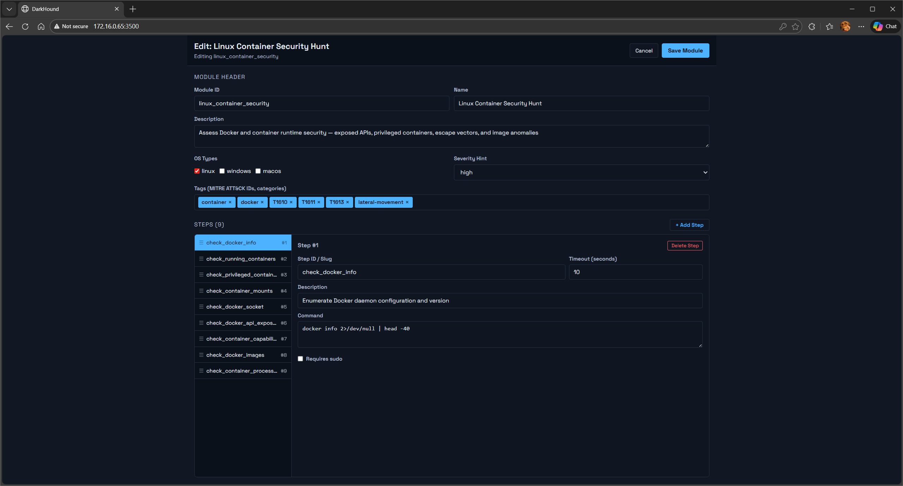
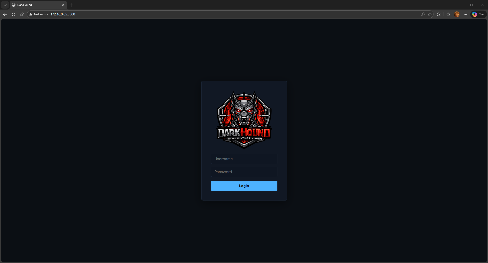
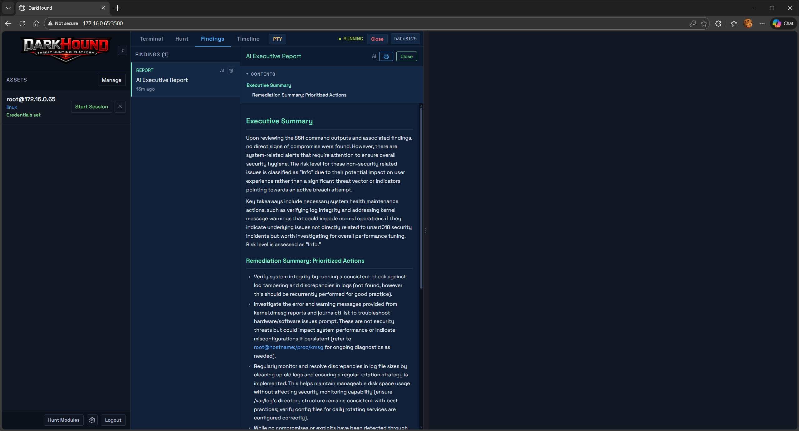
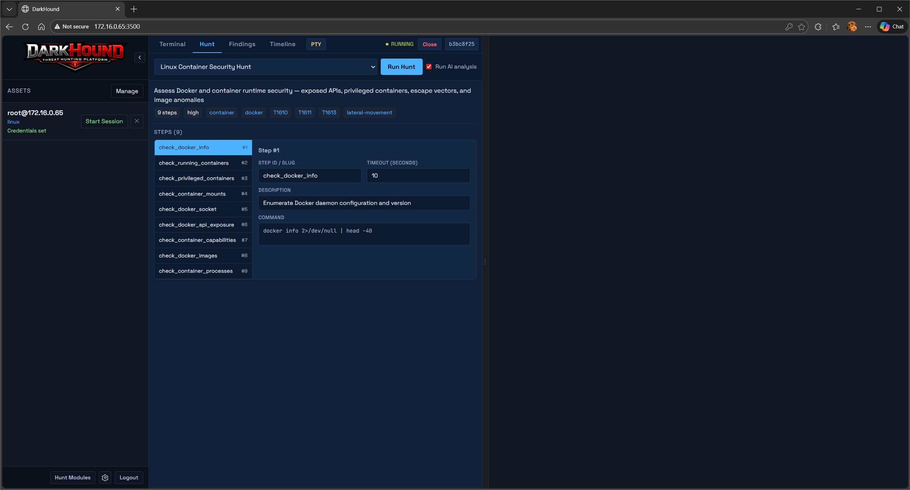

# DarkHound
Security hunting platform with a web UI, SSH-based asset sessions, hunt modules, AI-assisted analysis, and intelligence findings.

If you like my projects, please, https://buymeacoffee.com/ceilingduster

# Disclaimer
This project is the product of excessive caffeine and far too much Claude AI usage.  However, I have spent a great deal of time optimizing and polishing the code.  I've tested it on several VM's I have and its amazing how much visibility it can uncover.  Using better AI Models for the executive reporting will result in best results.  It has been tested with Ollama running PHI3 to Llama3.1.  I still recommend a cloud based model unless you have the DGX boxes to spare for better models. YMMV.

# Pictures






## Pre-requisites

- **Docker** and **Docker Compose** (recommended — runs everything in containers, not much else needed!)
- **AI provider** (at least one):
  - [Anthropic](https://console.anthropic.com/) API key, **or**
  - [OpenAI](https://platform.openai.com/) API key (or any OpenAI-compatible endpoint), **or**
  - [Ollama](https://ollama.com/) running locally (no API key needed)
- **SSH-accessible target hosts** to scan (Linux, macOS, or Windows with OpenSSH)
- **Optional enrichment API keys**: VirusTotal, Shodan, AbuseIPDB

### Without Docker (local dev)

- Python 3.12+
- Node.js 22+ / npm
- PostgreSQL 16+
- HashiCorp Vault (optional — disabled by default in dev)

## Highlights

- Asset manager with SSH credentials, sudo support, and CSV import/export.
- Hunt modules CRUD and execution with step orchestration.
- AI Executive Report generation with streaming output.
- Findings, timeline, and enrichment events over WebSocket.
- Docker-based dev environment (Postgres, Vault, backend, frontend).

## Default Credentials

```
username: admin
password: changeme
```

## Architecture

- Backend: FastAPI app in backend/app
- Frontend: Vite + React app in frontend
- DB: Postgres (alembic migrations in alembic/)
- Hunt modules: markdown specs in hunt_modules/

## Quickstart (Docker)

1) Copy the .env.sample to .env file
2) Start the stack:

   ./dev.sh

3) Go grab a coffee, can take a minute or so to bootup.
4) Open the UI:

   http://localhost:3500

5) Login and change password (cog icon at the bottom of the sidebar)

## Local Dev (without Docker) - NOT TESTED

Backend:

- make install
- make dev-backend

Frontend:

- cd frontend
- npm install
- npm run dev

## Common Make Targets

- make up / make down / make logs
- make migrate / make migrate-create / make migrate-down
- make lint / make test / make audit

## Ports

- 3500: Frontend
- 8000: Backend API
- 5432: Postgres
- 8200: Vault (dev)

## Environment Variables (selected)

- AI_PROVIDER, ANTHROPIC_API_KEY, ANTHROPIC_MODEL
- OPENAI_API_KEY, OPENAI_MODEL, OPENAI_BASE_URL
- OLLAMA_HOST, OLLAMA_MODEL
- VIRUSTOTAL_API_KEY, SHODAN_API_KEY, ABUSEIPDB_API_KEY
- ADMIN_USERNAME, ADMIN_PASSWORD
- CORS_ORIGINS

## Notes

- Alembic migrations are required for DB schema updates.
- The backend uses an async SQLAlchemy engine and emits WebSocket events.
- The UI expects the backend at /api/v1 (see frontend/src/api/client.ts).
- Minimal security controls (auth).  Don't put it on the external Internet.

### Windows 11

Install OpenSSH server on Windows 11
To install OpenSSH server on Windows 11, follow the steps outlined below:

1. Open Settings.
2. Navigate to System on the sidebar.
3. Click/tap on Optional Features.
4. Press the View features button.
5. Select the OpenSSH Server checkbox.
6. Press the Next button.

With that, you are done installing OpenSSH server on Windows 11.

# Liability

Standard Software Liability Disclaimer

Disclaimer of Warranties
This software is provided “as is” and “as available,” without warranties of any kind, whether express or implied, including but not limited to implied warranties of merchantability, fitness for a particular purpose, and non-infringement. The developer does not warrant that the software will be error-free, uninterrupted, secure, or free of harmful components.

Limitation of Liability
To the fullest extent permitted by applicable law, the developer shall not be liable for any indirect, incidental, special, consequential, or punitive damages, including but not limited to loss of profits, data, business, or goodwill, arising out of or related to the use of or inability to use the software, even if advised of the possibility of such damages.

User Responsibility
The user assumes full responsibility for the use of the software. The user is solely responsible for verifying results, maintaining backups, and ensuring compatibility with their systems and requirements.

Assumption of Risk
Use of the software is at the user’s own risk. The developer disclaims all liability for damages resulting from misuse, misconfiguration, or unintended application of the software.

Compliance & Legal Use
The user is responsible for ensuring that use of the software complies with all applicable laws and regulations. The developer is not responsible for unlawful use.

Jurisdiction
This disclaimer shall be governed by the laws of Canada.
